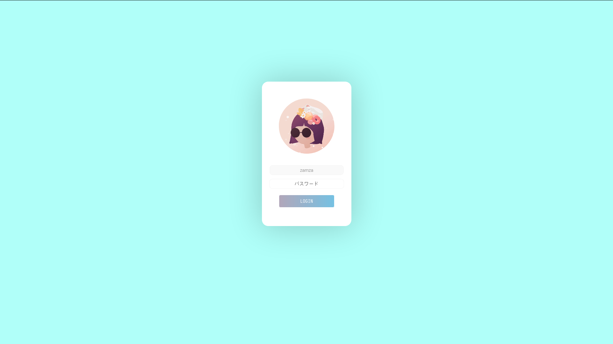

  

## Gab Lightdm-weebkit
- LightDM-<b>weebkit</b> Theme with modern style :D
- ~~More colorfull & animated background!~~
- Single color background
- animated Button too!!
- ~~Support MultiAccount~~
- Multiple accounts don't work properly yet :D 
- ~~but requires more processor resources :( 10% avg.~~

  

## What is LightDM Webkit ?
The lightdm-webkit-greeter allows you to choose a background image directly on the login screen. It also offers an option to display a random image each time it starts if you use the lightdm-gab-gradient theme. 
By default, images are sourced from `/usr/share/backgrounds` . You can change the background images directory by editing lightdm-webkit-greeter.conf

## Installation
Instructions will differ for every platform, but I can tell you how to install it on `Xubuntu`

1. Install and enable `lightdm` and `lightdm-webkit-greeter`
2. In the terminal, navigate to `/usr/share/lightdm-webkit/themes/`
3. Clone this repository here, it should create a folder called `lightdm-gab-gradient`
4. Enable the theme in your `/etc/lightdm/lightdm-webkit-greeter.conf`
5. Replace lightdm-gtk to lightdm-webkit in your `/usr/share/lightdm/lightdm.conf.d/60-lightdm-gtk-greeter.conf`
6. change line code `greeter-session=lightdm-gtk-greeter` to `greeter-session=lightdm-webkit-greeter`

## Font required
you must install this `fonts`

- <del>Segoe UI : https://github.com/meloncholy/mt-stats-viewer/raw/master/public/fonts/segoe-ui/segoeui.ttf</del> 
- <del>iosevka  : https://github.com/be5invis/Iosevka/releases/download/v2.0.1/01-iosevka-2.0.1.zip</del> 
- SFNS     : https://github.com/supermarin/YosemiteSanFranciscoFont

or you can customize in `CSS`

Thanks to [Agatha Yu](https://giphy.com/agatha) for the profile picture!
